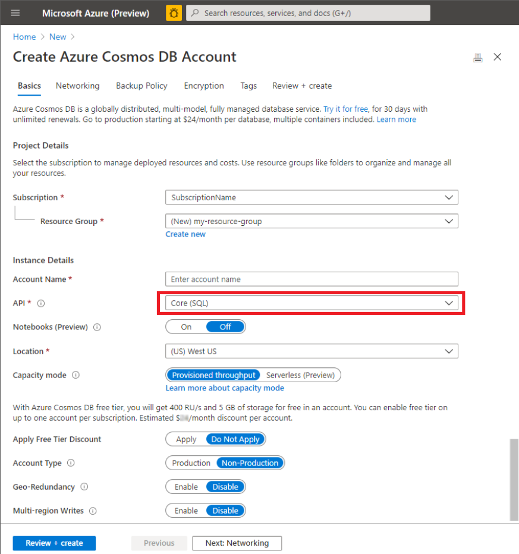

# How to use CosmosDB Helper Library  

   >You need to have Azure subscription and provisioned Cosmos DB (SQL API or Mongo).  
   >
   >Let's start it with Cosmos DB with SQL API (You may easily shift it for Mongo API later)  
  
   

## Work with Cosmos DB SDK
### 0. Pre-requisites   

- We need to prepare CosmosDB Azure resources before starting it.

I assume you have CosmosDB SQL API interface instance and CosmosDB Mongo API interface instance.    

If you don't have it, please prepare your CosmosDB resources. Here is the link [how to provision your Cosmos DB resources from Azure Portal](https://docs.microsoft.com/en-us/azure/cosmos-db/create-cosmosdb-resources-portal)  
Please make sure which API are you working with.  

- .NET Framework 5.0  
  
The Cosmos DB Helper libraries are compile with .NET Framework 5.0  
Before starting it, you need to install .NET Framework 5.0 in your development environment.  
If you don't have it, please install it from here - [.NET Framework 5.0 SDK Download](https://dotnet.microsoft.com/download/dotnet/thank-you/sdk-5.0.100-windows-x64-installer)

If you tried to load the solution file with your Visual Studio 2019 without installing .NET Framework 5.0,  
You might get following error :  

>\Program Files\dotnet\sdk\3.1.201\Microsoft.Common.CurrentVersion.targets(1177,5): error MSB3644:   
>The reference assemblies for .NETFramework,Version=v5.0 were not found.   
>To resolve this, install the Developer Pack (SDK/Targeting Pack) for this framework version or retarget your application.  
>You can download .NET Framework Developer Packs at https://aka.ms/msbuild/developerpacks 

Unfortunately this link doesn't point .NET Framework version 5, only 4.8 now.  
To download version 5, you can download it from here [https://dotnet.microsoft.com/download/visual-studio-sdks](https://dotnet.microsoft.com/download/visual-studio-sdks)
and I do recommend you upgrade your Visual Studio version up to 16.8.x.

- VS Code  
    
It's OK to start with Visual Studio 2019 but I'm going to start with VS Code in this hands on.  
If you don't have it, you may download it from here - [Download VSCode](https://code.visualstudio.com/) 

### 1. Create Project
Please make sure all of pre-requisites are all set.  
Let's start hands on from now on!

Create Console project from Console Window
                
    dotnet new console -n CosmosHandsOn --framework net5.0

After creating Console project name CosmosHandsOn, Switch the directory to newly created project.  

    cd CosmosHandsOn

### 2. Add Reference CosmosDB Helper
After switching the directory, add package Reference with Nuget installation

    dotnet add package EAE.Solutions.CosmosDB.SQL --version 0.6.1

  

### 3. Define Entity Class
After referencing CosmosDB Helper, let's define Entity Class will be stored in CosmosDB

Open your VS Code with this command

    code .

and add Entity Class name ToDo.cs  

  

Define ToDo class with inheriting CosmosEntityBase in Microsoft.Solutions.CosmosDB namespace.  
CosmosEntityBase class has responsibility for managing Entity's ID and PartitionKey which can impact to retrieving performance in the cosmos DB.

    using System;
    using Microsoft.Solutions.CosmosDB;
    namespace CosmosHandsOn
    {
        public class ToDo : CosmosEntityBase
        {
            public string title { get; set; }
            public Status status { get; set; }
            public DateTime startDate { get; set; }
            public DateTime endDate { get; set; }
            public string notes { get; set; }

            private int _percentComplete;

            public int percentComplete
            {
                get { return _percentComplete; }
                set
                {
                    if ((percentComplete < 0) || (percentComplete > 100))
                    {
                        throw new OverflowException("percent value should be between 0 to 100");
                    }
                    else
                    {
                        _percentComplete = percentComplete;
                    }
                }
            }
        }

        public enum Status { New, InProcess, Done }
    }

### 4. Define Entity Collection Class
add new Entity Collection Service Class name ToDoService.cs  
    

Define ToDoService class with inheriting SQLEntityCollectionBase and specify Entity Class types and it's identifier type.  
The Entity class which inherited from CosmosEntityBase has a Guid string identifier.

Once you inherit SQLEntityCollectionBase class, you should generate constructor has 2 parameters which will be assigned as Database ConnectionString and Database Name.

    using System;
    using Microsoft.Solutions.CosmosDB.SQL;

    namespace CosmosHandsOn{
        public class ToDoService : SQLEntityCollectionBase<ToDo>
        {
            public ToDoService(string DataConnectionString, string CollectionName) : base(DataConnectionString, CollectionName)
            {
            }
        }
    }

SQLEntityCollectionBase class provides features for CosmosDB CRUD operations with SQL API interface.  
Let's define CRUD operations in ToDoService.  

SQLEntityCollectionBase Class has EntityCollection property.  
You can operate(Crate, Replace, Update, Delete) CosmosDB with your own Entities with this EntityCollection property.  

- AddAsync method in EntityCollection can insert your object in CosmosDB

        public async Task<ToDo> Create(ToDo todo)
        {
            return await this.EntityCollection.AddAsync(todo);
        }

- SaveAsync method in EntityCollection can update your object in CosmosDB.
 
        public async Task<ToDo> Update(ToDo todo)
        {
            return await this.EntityCollection.SaveAsync(todo);
        }

- Get method in EntityCollection can retrieve Entity with Entity's id.(The Entitiy's identifier which will be managing by CosmosDB Helper class)
 
        public async Task<ToDo> Find(string id)
        {
            return await this.EntityCollection.GetAsync(id);
        }

- FindAllAsync method in EntityCollection can retrieve Entities with Linq statements.

        public async Task<IEnumerable<ToDo>> Search(string notes)
        {
            return await this.EntityCollection.FindAllAsync(new GenericSpecification<ToDo>(x => x.notes.Contains(notes)));
        }

- DeleteAsync method in EntityCollection can delete Entity by Entity's id or Entity itself.
  
        public async Task Delete(string id)
        {
            await this.EntityCollection.DeleteAsync(id);
        }

Done! You are ready to create, update, search and delete Entities with these simple methods.

This is full ToDoServices.cs codes

    using System;
    using Microsoft.Solutions.CosmosDB.SQL;
    using System.Threading.Tasks;
    using System.Collections.Generic;
    using Microsoft.Solutions.CosmosDB;

    namespace CosmosHandsOn{
        public class ToDoService : SQLEntityCollectionBase<ToDo>
        {
            public ToDoService(string DataConnectionString, string CollectionName) : base(DataConnectionString, CollectionName)
            {
            }

            public async Task<ToDo> Create(ToDo todo)
            {
                return await this.EntityCollection.AddAsync(todo);
            }

            public async Task<ToDo> Update(ToDo todo)
            {
                return await this.EntityCollection.SaveAsync(todo);
            }

            public async Task<ToDo> Find(string id)
            {
                return await this.EntityCollection.GetAsync(id);
            }

            public async Task<IEnumerable<ToDo>> Search(string notes)
            {
                return await this.EntityCollection.FindAllAsync(new GenericSpecification<ToDo>(x => x.notes.Contains(notes)));
            }

            public async Task Delete(string id)
            {
                await this.EntityCollection.DeleteAsync(id);
            }  
        }
    }

Now you may put this ToDoService on wherever you want to host it through MicroService containers or Azure Functions.  

Let's try to test it with Console Application from here.  

Open Programs.cs and define CosmosDB ConnectionString.  
To invoking asynchronous methods we need to change **static void Main** method signature to **async static Task Main** .  

Please check you CosmosDB's connection string from Azure portal and paste it like below.  

    using System;
    using System.Threading.Tasks;

    namespace CosmosHandsOn
    {
        class Program
        {
            static string connectionString = "{Put your connectionstring}";

            async static Task Main(string[] args)
            {
            }
        }
    }

And instancing ToDoService with connection string and Database name together.  
The SQLEntityCollectionBase which has been inherited by ToDoService is going to check existence of Database and once it is not exiting, it will generate Database automatically on the fly.

put this code for instancing ToDoService like below

        async static Task Main(string[] args)
        {
            var todoService = new ToDoService(connectionString, "CosmosHandson");
        }
It will create Database name "CosmosHandson"  
Now add the codes for testing ToDoService with this codes

Create ToDo object like below.
    
    var todo = new ToDo()
    {
        title = "This is test ToDo",
        startDate = DateTime.Now,
        endDate = DateTime.Now.AddDays(2),
        percentComplete = 0,
        notes = "Cosmos DB is really cool!",
        status = Status.New
    };

You might be acknowledged that ToDo class has id and __partitionkey properties.
You don't necessary to touch them from your code. the id and _partitionkey will be managed by CosmosDB Helper.

After instancing ToDo class let's add the codes consequently.  

    using System;
    using System.Threading.Tasks;

    namespace CosmosHandsOn
    {
        class Program
        {
            static string connectionString = "{Put your connectionstring};

            async static Task Main(string[] args)
            {
                var todoService = new ToDoService(connectionString, "CosmosHandson");

                var todo = new ToDo()
                {
                    title = "This is test ToDo",
                    startDate = DateTime.Now,
                    endDate = DateTime.Now.AddDays(2),
                    percentComplete = 0,
                    notes = "Cosmos DB is really cool!",
                    status = Status.New
                };

                //Insert ToDO
                var objTodo1 = await todoService.Create(todo);

                //Update ToDo
                objTodo1.title = "Updating test ToDo";
                await todoService.Update(objTodo1);

                //Search ToDo
                var objRetrived = await todoService.Find(objTodo1.id);
                Console.WriteLine($"Found object! it's title is {objRetrived.title}");

                //Find ToDos
                var todos = await todoService.Search("Cosmos");
                foreach (var item in todos)
                {
                    Console.WriteLine($"{item.id} - {item.title} - {item.notes} - {item.status}");
                }

                //Delete ToDos
                await todoService.Delete(objTodo1.id);
                Console.WriteLine($"The Todo object which has title - {objTodo1.title} has been removed");
            }
        }
    }

and Execute the code with pressing F5(Debugging) or CTRL + F5(Execute without Debugging)  
You may check every CRUD operation is working perfectly.

You are using CosmosDB SDK for SQL API library internally.  
If someone wants to use CosmosDB with EntityFramework library, you may easily shift your code for EntityFramework with changing tiny codes.  
  

---
   

## Work with Cosmos DB with EntityFramework library  
### 1. Add Reference  
Back to the directory of your project file and add reference CosmosDB Helper for EFCore Library with Nuget package installation

    dotnet add package EAE.Solutions.CosmosDB.EFCore --version 0.6.1

### 2. Inherit EFCoreEntityCollectionBase in ToDoService
Open the VS Code again from the source folder.  

    code .

In previous code, ToDoService inherited SQLEntityCollectionBase.  
Just change its base class with **EFCoreEntityCollectionBase** updating using Microsoft.Solutions.CosmosDB.SQL namespace to **Microsoft.Solutions.CosmosDB.EFCore**.  

    using System;
    using Microsoft.Solutions.CosmosDB.EFCore;
    using System.Threading.Tasks;
    using System.Collections.Generic;
    using Microsoft.Solutions.CosmosDB;

    namespace CosmosHandsOn{
        public class ToDoService : EFCoreEntityCollectionBase<ToDo>
        {
            public ToDoService(string DataConnectionString, string CollectionName) : base(DataConnectionString, CollectionName)
            {
            }

            public async Task<ToDo> Create(ToDo todo)
            {
                return await this.EntityCollection.AddAsync(todo);
            }

            public async Task<ToDo> Update(ToDo todo)
            {
                return await this.EntityCollection.SaveAsync(todo);
            }

            public async Task<ToDo> Find(string id)
            {
                return await this.EntityCollection.GetAsync(id);
            }

            public async Task<IEnumerable<ToDo>> Search(string notes)
            {
                return await this.EntityCollection.FindAllAsync(new GenericSpecification<ToDo>(x => x.notes.Contains(notes)));
            }

            public async Task Delete(string id)
            {
                await this.EntityCollection.DeleteAsync(id);
            }
            
        }
    }

That's it! Execute the code with pressing F5(Debugging) or CTRL + F5(Execute without Debugging)  
You may check your development experiences will be same whatever you are using CosmosDB SDK or EntityFramework.  

it's time to use CosmosDB Mongo API Service with our code.  

    

--- 

    
## Work with Cosmos DB for Mongo API
>It's easy!. Cosmos DBHelper provides exactly same development experience with previous one what we did.
>
>To start with CosmosDB for Mongo API, you need to provision CosmosDB for Mongo API first.  
>
>
>
>After provisioning CosmosDB for Mongo API, grep the connection string.
>The Connection for Mongo is different with CosmosDB for SQL API.

### 1. Add Reference  

Add CosmosDB mongo Helper library with nuget package reference in your source directory like below  

    dotnet add package EAE.Solutions.CosmosDB.Mongo --version 0.6.1

  

### 2. Inherit MongoEntityCollectionBase in ToDoService  
Open the VS Code again from the source folder.  

    code .

In previous code, ToDoService inherited EFCoreEntityCollectionBase.
Just change its base class with **MongoEntityCollectionBase** updating using Microsoft.Solutions.CosmosDB.EFCore namespace to **Microsoft.Solutions.CosmosDB.Mongo**.

    using System;
    using Microsoft.Solutions.CosmosDB.Mongo;
    using System.Threading.Tasks;
    using System.Collections.Generic;
    using Microsoft.Solutions.CosmosDB;

    namespace CosmosHandsOn{
        public class ToDoService : MongoEntntyCollectionBase<ToDo>
        {
            public ToDoService(string DataConnectionString, string CollectionName) : base(DataConnectionString, CollectionName)
            {
            }

            public async Task<ToDo> Create(ToDo todo)
            {
                return await this.EntityCollection.AddAsync(todo);
            }

            public async Task<ToDo> Update(ToDo todo)
            {
                return await this.EntityCollection.SaveAsync(todo);
            }

            public async Task<ToDo> Find(string id)
            {
                return await this.EntityCollection.GetAsync(id);
            }

            public async Task<IEnumerable<ToDo>> Search(string notes)
            {
                return await this.EntityCollection.FindAllAsync(new GenericSpecification<ToDo>(x => x.notes.Contains(notes)));
            }

            public async Task Delete(string id)
            {
                await this.EntityCollection.DeleteAsync(id);
            }
            
        }
    }

### 3. Update ConnectionString
> Don't forget to update your connection string for Mongo in programs.cs file!

That's all we should do to switch our code for using CosmosDB Mongo API.
Just Execute the code with pressing F5(Debugging) or CTRL + F5(Execute without Debugging)

## Dependency Injection in ASP.net

All of CosmosDB Helper is sharing [IDataRepositoryProvider](./src/Libraries/Microsoft.CosmosDB/../Microsoft.Solutions.CosmosDB/IDataRepositoryProvider.cs) interface.  

    namespace Microsoft.Solutions.CosmosDB
    {
        public interface IDataRepositoryProvider<TEntity>
        {
            IRepository<TEntity, TIdentifier> EntityCollection { get;  init ; }
        }
    }

so you may inject your dependency with this interface.

This is the sample code snippet for showing how to inject dependency into DoToService.

    services.AddTransient<IDataRepositoryProvider<ToDo>, TODOService>(x => { return new TODOService(configuration["ConnectionString"], "CosmosHandson"); });

You may check the DOTO ASP.net API sample project from [here](../../tree/main/src/Sample/Microsoft.Solutions.CosmosDB.WebHost)

## Working in Visual Studio 2019 or 2017
Absolutely Visual Studio is the first citizen .NET Development.
If you want to start hands on from .NET Framework, you may reference proper package with Nuget Package manager.

The CosmosDB Helper library is pre-lease version. at this moment.  
Don't forget check **include prelease** box when you are retrieving packages.
