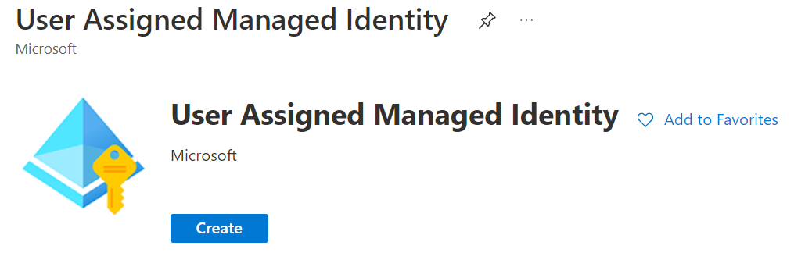
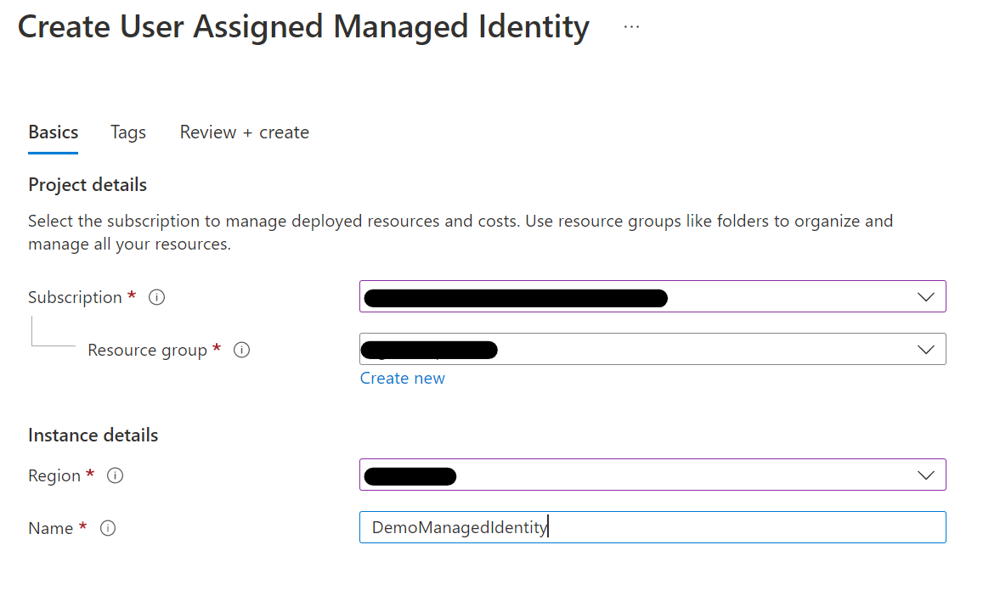
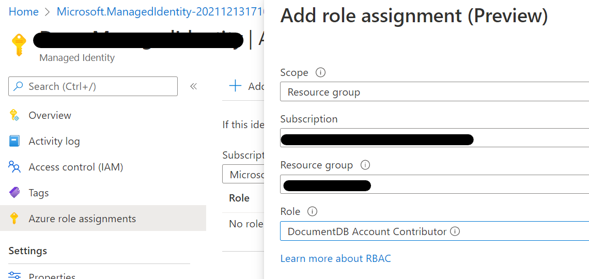

# EAE.Solutions.CosmosDB.Security.ManagedIdentity
[EAE.Solutions.CosmosDB.Security.ManagedIdentity](src/libraries/Microsoft.Solutions.CosmosDB.Security.ManagedIdentity/) helps retrieve Azure Cosmos DB Connection Strings with Managed Identity Information.  

It may elimiate the security concerns of managing credentials/secrets and only can access Azure Cosmos DB from developer's dev environment or designated Azure subscription.

Using Managed Identity you can control any Azure resources with predefined (or custom defined) RBACs.

If you need to get more information about Azure Managed Identity, Please check this URL - https://docs.microsoft.com/en-us/azure/active-directory/managed-identities-azure-resources/overview  

## How to use EAE.Solutions.CosmosDB.Security.ManagedIdentity  

### 1. Create User define Managed Identity  
Create User Assigned Managed Identity in your resource group  
  

Fill up information where it being deployed


After deploying User Assigned Managed Identity, Let's assign the predefined roles for Azure Cosmos DB

### 2. Add Role Assignment
Select Azure role assignments in Managed Identity that you created then select **Add role assignment** on top then assign its role like below :  
**DocumentDB Account Contributor** can retrive Read/Write Connection String Information within designated resource group.



### 3. Get Subscription ID, Resource Group Name and Client ID  
Go to **Overview** menu in your Managed Identity and grap the three information - **Subscription ID**, **Regource group Name** and **Client ID**

### 4. Get Azure Cosmos DB Connection String
Install **EAE.Solutions.CosmosDB.Security.ManagedIdentity** Package in your Visual Studio or Visual Studio Code from Nuget :  

```
dotnet add package EAE.Solutions.CosmosDB.Security.ManagedIdentity --version 0.7.3
```  

Get Azure Cosmos DB Connection String like below :  

``` csharp
//Should install Package from Nuget (EAE.Solutions.CosmosDB.Security.ManagedIdentity)
using Microsoft.Solutions.CosmosDB.Security.ManagedIdentity;

//SubscriptionID, ResourceGroup Name, Cosmos DB Account Name and Managed Identity ClientID is required
public async Task<CosmosConnectionStrings> GetConnectionInfo(string SubscriptionId, 
                                                                string ResourceGroupName, 
                                                                string CosmosAccountName, 
                                                                string ManagedIdentityClientID)
{
    return await ConnectionStringAccessor
                                    .Create(SubscriptionId, ResourceGroupName, CosmosAccountName)
                                    .GetConnectionStringsAsync(ManagedIdentityClientID);
}


```
The **CosmosConnectionStrings** class contains 4 connection strings - Primary/Secondary Read,Write ConnectionStrings and Primary/Seconday ReadOnly Connection strings. You may choose one of them at your preference.

```csharp
    public class CosmosConnectionStrings
    {
        public string PrimaryReadWriteKey { get; set; }
        public string SecondaryReadWriteKey { get; set; }
        public string PrimaryReadOnlyKey { get; set; }
        public string SecondaryReadOnlyKey { get; set; }
    }
```

You may check the [Sample Application code](src/Sample/Microsoft.Solutions.CosmosDB.WebHost/Startup.cs) for it from here - [Web Host Sample](src/Sample/Microsoft.Solutions.CosmosDB.WebHost)