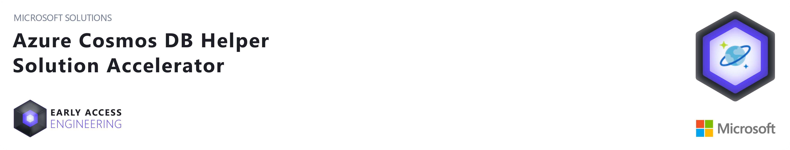

## About this repository
Welcome to Azure CosmosDB Solution Accelerator (Azure CosmosDB Helper).  

Azure CosmosDB Helper supports MongoDB API and SQL Core API interface with LINQ statements.  
It abstracts how data can be persisted and retrived from Database by implmenting Repository Pattern.  
In Architecture perspective, it decouples the data access layer from business layer so developers can their Business Entities CRUD Operations through much streightforward way without learning specific query languages for each APIs.  

Once your business logic has been built with LINQ statements with Azure CosmosDB Helper, you may easily switch two APIs (SQL and Mongo) with very few code changes.  

## Version History
 - ### v 0.7.3 Update
    - #### Access Azure CosmosDB with [Managed Identity](https://docs.microsoft.com/en-us/azure/active-directory/managed-identities-azure-resources/overview)
        - [**EAE.Solutions.CosmosDB.Security.ManagedIdentity**](ManagedIdentity.md) has been released
            - Get rid of secrets from your configuration or source code
            - Retireve Azure Cosmos DB Connection Strings with Managed Identity (**DocumentDB Account Contributor Role**)
            - Persistent Azure resource access with single Managed Identity
            
- ### v 0.7 Update  
   - #### Change feed processor for Azure CosmosDB Core SQL API  
      - **Microsoft.Solutions.CosmosDB.SQL.ChangeFeed** (ChangeFeed Processor Helper) has been released  
        - Automatic lease container creation  
        - Multiple process host support for parallel execution in Microservice deployment
        - Delegate process template for detecting ChangeSets. 
          

   - #### Improved performance with optimized Connection Object 
   
   - #### CosmosEntityBase Name has been changed to **CosmosDBEntityBase**  
     - Azure CosmosDB Core SQL API EF Core Deprecated
        - Azure CosmosDB Provider - EF Core wrapper has been deprecated  
          (EF Core Framework's performance issue)  
        
- ### v 0.6 First Release  
   - #### Azure CosmosDB Core SQL API support   
       - Azure CosmosDB SDK wrapper  
       - Azure CosmosDB Provider - EF Core wrapper  
   - #### Azure CosmosDB MongoDB SQL API Support  
       - MongoDB.Driver wrapper  
       
## Prerequisites
This source code has been built with .NET framework 5.0
(but you may build it with .NET Core 3.1 as well)

## Purpose 
CosmosDB Solution Accelerator helps developers who wants to use CosmosDB with **SIMPLE** and **DEVELOPMENT CONSISTENCY**.  
Developers can easily switch CosmosDB APIs between SQL API and Mongo API with little changes

## How to Work with it
You may start with [HandsOn](./HandsOn.md) page.  
All of libraries can be referenced though [Nuget packages](https://www.nuget.org/packages?q=EAE.Solutions) to your project.

## License
Copyright (c) Microsoft Corporation

All rights reserved.

MIT License

Permission is hereby granted, free of charge, to any person obtaining a copy of this software and associated documentation files (the ""Software""), to deal in the Software without restriction, including without limitation the rights to use, copy, modify, merge, publish, distribute, sublicense, and/or sell copies of the Software, and to permit persons to whom the Software is furnished to do so, subject to the following conditions:

The above copyright notice and this permission notice shall be included in all copies or substantial portions of the Software.

THE SOFTWARE IS PROVIDED AS IS, WITHOUT WARRANTY OF ANY KIND, EXPRESS OR IMPLIED, INCLUDING BUT NOT LIMITED TO THE WARRANTIES OF MERCHANTABILITY, FITNESS FOR A PARTICULAR PURPOSE AND NONINFRINGEMENT. IN NO EVENT SHALL THE AUTHORS OR COPYRIGHT HOLDERS BE LIABLE FOR ANY CLAIM, DAMAGES OR OTHER LIABILITY, WHETHER IN AN ACTION OF CONTRACT, TORT OR OTHERWISE, ARISING FROM, OUT OF OR IN CONNECTION WITH THE SOFTWARE OR THE USE OR OTHER DEALINGS IN THE SOFTWARE

## Contributing

This project welcomes contributions and suggestions.  Most contributions require you to agree to a
Contributor License Agreement (CLA) declaring that you have the right to, and actually do, grant us
the rights to use your contribution. For details, visit https://cla.opensource.microsoft.com.

When you submit a pull request, a CLA bot will automatically determine whether you need to provide
a CLA and decorate the PR appropriately (e.g., status check, comment). Simply follow the instructions
provided by the bot. You will only need to do this once across all repos using our CLA.

This project has adopted the [Microsoft Open Source Code of Conduct](https://opensource.microsoft.com/codeofconduct/).
For more information see the [Code of Conduct FAQ](https://opensource.microsoft.com/codeofconduct/faq/) or
contact [opencode@microsoft.com](mailto:opencode@microsoft.com) with any additional questions or comments.

## Trademarks

This project may contain trademarks or logos for projects, products, or services. Authorized use of Microsoft 
trademarks or logos is subject to and must follow 
[Microsoft's Trademark & Brand Guidelines](https://www.microsoft.com/en-us/legal/intellectualproperty/trademarks/usage/general).
Use of Microsoft trademarks or logos in modified versions of this project must not cause confusion or imply Microsoft sponsorship.
Any use of third-party trademarks or logos are subject to those third-party's policies.
